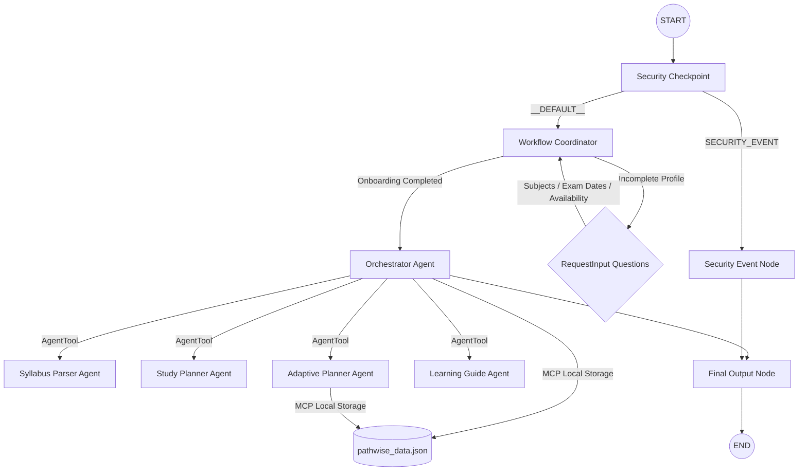

# PathWise — AI Study Decision Companion

PathWise is an AI study decision companion designed to help students overcome decision fatigue by answering one simple question: **"What should I study next?"** 

Unlike generic calendar apps, PathWise builds and dynamically adapts a learning roadmap based on the student's syllabus, exam dates, daily availability, and topic difficulty feedback.

## Prerequisites

- **Python 3.11+**
- **uv** (Python package manager)
- **Gemini API Key** from [Google AI Studio](https://aistudio.google.com/apikey)

## Quick Start

```bash
# Clone the repository
git clone <repo-url>
cd pathwise

# Copy environment template and add your GOOGLE_API_KEY
cp .env.example .env

# Install dependencies
make install

# Launch the Streamlit Frontend UI
make frontend

# Or launch the ADK Playground UI
make playground
```
*Note: On Windows, launch the Streamlit frontend using:*
```powershell
uv run streamlit run streamlit_app.py --server.port 18082
```

## System Architecture



## How to Run

- **`make playground`**: Launch the local development server and interactive web UI at `http://localhost:18081`.
- **`make run`**: Run the agent as a local FastAPI web server.

## Sample Test Cases

### Test Case 1: Conversational Onboarding
- **Input**: Sending `hello` to a fresh session.
- **Expected Flow**: The security node passes the input. The coordinator detects that no profile exists and triggers `RequestInput` for your list of subjects.
- **Check**: You should see a prompt in the Playground UI: *"Welcome to PathWise! Let's get started. What subjects/courses are you studying?"*

### Test Case 2: Today's Focus Query
- **Input**: `"What should I study next?"` (after completing onboarding).
- **Expected Flow**: The orchestrator fetches the roadmap from the local storage using the MCP server, queries the Learning Guide, and presents the next pending topic.
- **Check**: The Playground UI displays **Today's Focus** with the recommended topic, estimated study time, pedagogical reason for selection, and resources.

### Test Case 3: Adaptive Schedule Adjustment
- **Input**: `"I missed my study block today."` or `"This topic is too hard."`
- **Expected Flow**: The orchestrator delegates to the Adaptive Planner. The planner reads the roadmap, flags the current task as missed (or adds a split sub-task for hard topics), and reorganizes the upcoming tasks.
- **Check**: The response explains how the roadmap was adjusted, and [pathwise_data.json](file:///c:/Users/Pranavi/OneDrive/Documents/adk-workspace/pathwise/pathwise_data.json) displays the modified study queue.

## Troubleshooting

1. **Error: `ModuleNotFoundError: No module named 'mcp'`**
   - *Fix*: Run `uv sync` to ensure all dependencies from `pyproject.toml` are correctly installed.
2. **Error: `404 model not found` on first query**
   - *Fix*: Ensure `.env` is pointing to a live model (like `gemini-2.5-flash`). Do not use retired `gemini-1.5` models.
3. **Windows Hot-Reload Failure (server state does not update after code edit)**
   - *Fix*: Fully terminate the server using PowerShell:
     ```powershell
     Get-Process -Id (Get-NetTCPConnection -LocalPort 18081, 8090 -ErrorAction SilentlyContinue).OwningProcess | Stop-Process -Force
     ```
     Then relaunch the playground command.

## Push to GitHub

1. Create a new repo at https://github.com/new
   - Name: `pathwise`
   - Visibility: Public or Private
   - Do NOT initialize with README (you already have one)

2. In your terminal, navigate into your project folder:
   ```bash
   cd pathwise
   git init
   git add .
   git commit -m "Initial commit: pathwise ADK agent"
   git branch -M main
   git remote add origin https://github.com/<your-username>/pathwise.git
   git push -u origin main
   ```

3. Verify `.gitignore` includes:
   ```
   .env          ← your API key — must NEVER be pushed
   .venv/
   __pycache__/
   *.pyc
   .adk/
   ```

⚠️ **NEVER** push `.env` to GitHub. Your API key will be exposed publicly.

## Assets

- [Architecture Diagram](file:///c:/Users/Pranavi/OneDrive/Documents/adk-workspace/pathwise/assets/architecture_diagram.png)
  
- [Cover Banner](file:///c:/Users/Pranavi/OneDrive/Documents/adk-workspace/pathwise/assets/cover_page_banner.png)
  
