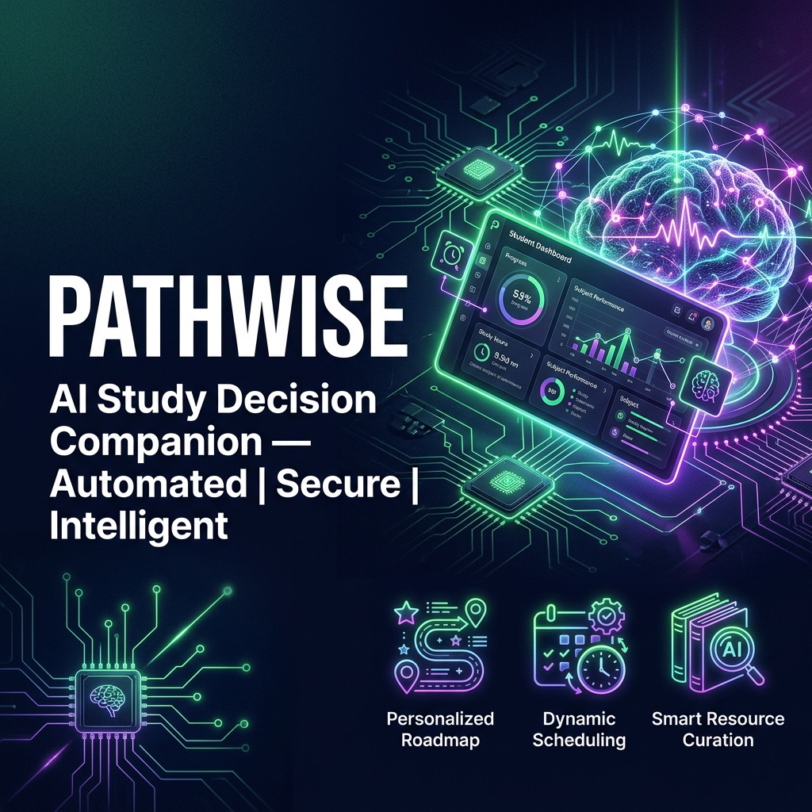
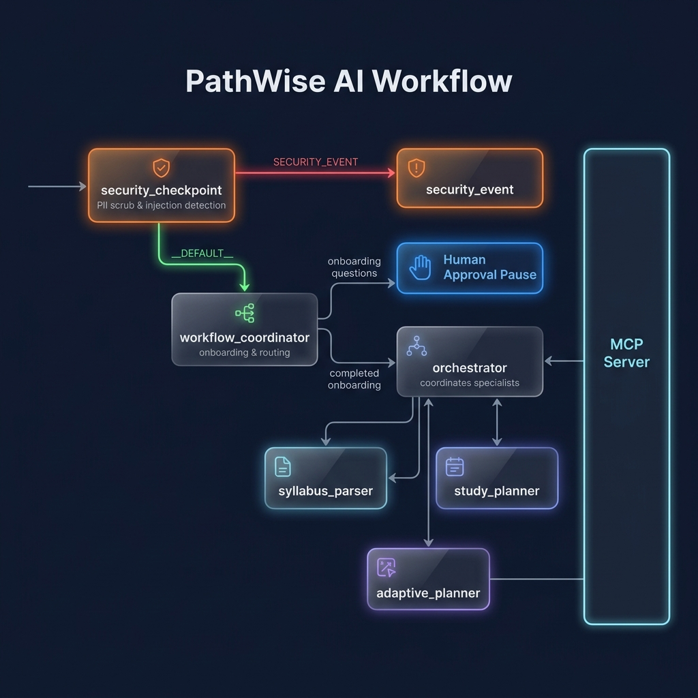
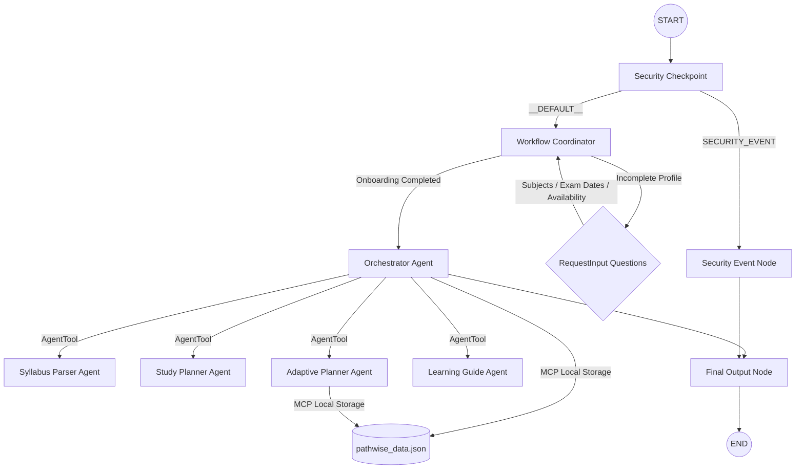

# PathWise

<p align="center">
  
</p>

<h3 align="center">
AI-powered Study Decision Companion built with Google ADK
</h3>

<p align="center">
Helping students overcome study decision fatigue by answering one simple question:
<b>"What should I study next?"</b>
</p>

---

## Problem

Students often lose valuable study time deciding where to start instead of actually studying. Managing multiple subjects, different exam dates, missed sessions, and changing schedules creates decision fatigue and inconsistent study habits.

PathWise solves this by acting as an intelligent study companion. Instead of creating a static timetable, it builds a personalized study roadmap, continuously adapts it, and recommends the best topic to study next based on the student's progress.

---

## Features

- Personalized AI-generated study roadmap
- Conversational onboarding
- Adaptive study planning
- "Today's Focus" recommendations
- Progress tracking
- Curated learning resources
- Secure input validation
- MCP-powered persistent storage
- Modern Streamlit dashboard

---

## Demo

### Cover Banner

<p align="center">

</p>

### System Architecture

<p align="center">

</p>

---

## Architecture



---

## How It Works

1. The student starts a conversation with PathWise.
2. The onboarding workflow collects subjects, exam dates, study availability, preferred session length, and strengths or weaknesses.
3. The Study Planner creates a personalized roadmap.
4. The Learning Guide recommends the next topic to study with explanations and learning resources.
5. If the student misses a study session or struggles with a topic, the Adaptive Planner automatically reorganizes the roadmap.
6. Student progress is stored using an MCP server for future sessions.

---

## Tech Stack

- Google Agent Development Kit (ADK)
- Gemini 2.5 Flash
- Python
- Streamlit
- MCP (Model Context Protocol)
- uv Package Manager

---

## Project Structure

```
pathwise/
│
├── app/
│   ├── agent.py
│   ├── mcp_server.py
│   └── ...
│
├── assets/
│   ├── cover_page_banner.png
│   └── architecture_diagram.png
│
├── tests/
│
├── streamlit_app.py
├── pyproject.toml
├── Makefile
└── README.md
```

---

## Running Locally

### Clone the repository

```bash
git clone https://github.com/<your-username>/pathwise.git
cd pathwise
```

### Create environment

```bash
cp .env.example .env
```

Add your Google Gemini API Key inside `.env`.

### Install dependencies

```bash
uv sync
```

### Launch the Streamlit application

```bash
make frontend
```

Or on Windows

```powershell
uv run streamlit run streamlit_app.py --server.port 18082
```

---

## Example Conversation

**Student**

> I missed today's study session.

**PathWise**

> No worries. I've rescheduled today's study block, redistributed the remaining topics across your available study days, and updated your roadmap while keeping your exam deadlines in mind.

---

## Security

PathWise includes multiple safety mechanisms.

- Personal information (emails and phone numbers) is automatically scrubbed.
- Prompt injection attempts are detected and blocked.
- Structured security audit logs are generated.
- Academic misuse requests such as cheating or plagiarism are rejected.

---

## Future Improvements

- Google Calendar integration
- Mobile application
- Study reminders and notifications
- LMS integration
- Cloud database support
- Multi-device synchronization

---

## Author

**Pranavi**

Built with Google Agent Development Kit (ADK) for the Agents for Good Hackathon.