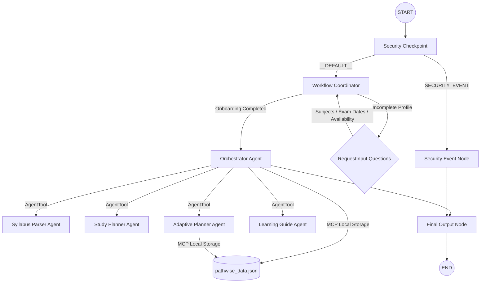

# PathWise Submission Write-Up

## Problem Statement
University and college students preparing for exams face significant decision fatigue when trying to plan and manage their study sessions. With multiple syllabi, varying exam dates, and changing daily availability, students often waste valuable study time deciding where to start, what to prioritize, or how to recover after missing a study session. PathWise solves this by serving as an AI study decision companion that answers the simple question: *"What should I study next?"* 

---
## Solution Overview

PathWise is an AI-powered study decision companion built using Google's Agent Development Kit (ADK). Rather than functioning as a conventional study planner or calendar application, it acts as an intelligent assistant that continuously guides students toward their next most important learning task.

The application begins by collecting information about the student's academic profile through a conversational onboarding experience. Instead of requiring lengthy forms, the workflow gradually gathers subjects, examination schedules, study availability, preferred session duration, and areas of strength and weakness. This information becomes the foundation for creating a personalized learning roadmap.

Once onboarding is complete, PathWise generates a structured study plan using multiple specialized AI agents working together. Each agent performs a dedicated responsibility, such as parsing syllabus information, generating study plans, adapting schedules when progress changes, and recommending learning resources. An orchestrator agent coordinates communication between these specialists to ensure that every response remains consistent and context-aware.

One of the primary goals of PathWise is reducing decision fatigue. Students often lose valuable study time deciding what topic deserves attention first. By continuously evaluating pending tasks, completed work, missed sessions, and learner feedback, PathWise removes this cognitive burden and presents a clear recommendation for the next study activity.

The project combines conversational AI, workflow orchestration, secure data handling, and adaptive planning into a single educational assistant. This creates a personalized experience while remaining modular enough to support future improvements and integration with external learning platforms.

## Solution Architecture

---

## Concepts Used

1. **ADK Workflow**: The application's main topology is structured as a stateful, graph-based DAG using `google.adk.workflow.Workflow` in `agent.py`
2. **LlmAgent**: Five specialized agents (`orchestrator_agent`, `syllabus_parser_agent`, `study_planner_agent`, `adaptive_planner_agent`, and `learning_guide_agent`) are declared in `agent.py` to perform isolated cognitive tasks.
3. **AgentTool**: Used by the `orchestrator_agent` to dynamically delegate tasks to specialist agents (`SyllabusParser`, `StudyPlanner`, etc.) in `agent.py`
4. **MCP Server**: Implemented in `mcp_server.py` to manage the student profile and study roadmap storage via stdio-based transport, and wired into agents using `McpToolset`.
5. **Security Checkpoint**: The `security_checkpoint` function node in `agent.py` intercepts all user inputs to enforce PII scrubbing, injection blocklists, and domain-specific validation.
6. **Agents CLI**: Scaffolding was generated using `agents-cli` and configured to run locally via `Makefile` targets.

---

## Security Design

- **PII Scrubbing**: User inputs are scanned using regular expressions to scrub email addresses, phone numbers, and SSNs. This protects students from accidentally submitting personal information.
- **Prompt Injection Detection**: Inputs are checked against a blocklist (`ignore instructions`, `system prompt`, `dan mode`, etc.). If triggered, the workflow immediately routes traffic to a terminal security event node.
- **Structured Audit Logging**: Stderr logs output a structured JSON object detailing every security checkpoint decision (status, event, and severity).
- **Domain restriction**: Exclude keywords like `hack`, `steal`, `cheat`, or `plagiarize` to ensure academic integrity.

---

## MCP Server Design

The `mcp_server.py` exposes the following tools:
1. `get_student_profile`: Retrieves student profile from `pathwise_data.json`
2. `save_student_profile`: Saves student fields gathered during onboarding.
3. `get_roadmap`: Retrieves the list of study tasks.
4. `save_roadmap`: Stores a newly generated or modified roadmap.
5. `update_progress`: Updates status (completed/missed) and difficulty feedback.
6. `retrieve_resources`: Suggests curated textbook and video resources.
7. `generate_roadmap_summary`: Summarizes progress metrics.

---

## Human-in-the-Loop (HITL) Flow

PathWise requires a conversational onboarding workflow using `google.adk.events.request_input.RequestInput` inside the `workflow_coordinator` node. This pauses execution to gather:
    - Subjects/courses
- Exam dates
- Daily study availability
- Preferred session lengths
- Strengths and weaknesses

Gathering this information directly from the student guarantees a hyper-personalized roadmap.

---

## Demo Walkthrough

1. **Onboarding**: A new student interacts with PathWise, providing study attributes in response to step-by-step questions. A personalized JSON roadmap is then generated.
2. **"Today's Focus"**: Asking *"What should I study next?"* prints the first topic from the roadmap queue, estimated time, resources, and explanation.
3. **Adaptive Update**: Providing feedback like *"Genetics was too hard"* triggers the Adaptive Planner to modify the roadmap (e.g. splitting the topic or adding study buffer hours).

---

## Impact / Value Statement

PathWise addresses a common but often overlooked challenge in education: decision fatigue. Many students spend significant amounts of time deciding what to study rather than studying itself. This project transforms that experience into a guided workflow where every study session begins with a clear recommendation.

By combining conversational onboarding, intelligent planning, adaptive scheduling, and secure workflow management, PathWise provides students with a personalized study companion instead of a static planner. It continuously adapts to changing schedules, learner feedback, and completed tasks, making the study experience more resilient and less stressful.

The modular architecture built with Google's Agent Development Kit also demonstrates how multiple AI agents can collaborate to solve practical educational problems. Beyond examination preparation, the same architecture could support professional certification learning, corporate training, or lifelong learning scenarios.

Ultimately, PathWise aims to help students spend less time planning and more time learning, improving productivity, reducing stress, and encouraging consistent academic progress.

## Challenges Faced

Developing PathWise involved several technical and design challenges. One of the biggest challenges was coordinating multiple AI agents while maintaining a smooth conversational experience. Since different agents specialize in different tasks, the orchestrator needed to ensure that requests were routed correctly without exposing unnecessary complexity to the user.

Another challenge involved designing a conversational onboarding process. Rather than requesting all information at once, the application collects information step by step using Human-in-the-Loop interactions. This required careful workflow management so that the conversation could pause, collect user input, and continue seamlessly.

Security was another important consideration. Because users may accidentally enter personal information or attempt unsupported requests, a dedicated security checkpoint was introduced before any AI reasoning occurs. This improves reliability while protecting user privacy and maintaining academic integrity.

Finally, creating an adaptive study roadmap required balancing simplicity with flexibility. The roadmap should change when students miss sessions or struggle with topics, but it should remain understandable and predictable. This led to the implementation of the Adaptive Planner agent, which reorganizes study tasks while preserving the overall learning objectives.

## Future Scope

PathWise has been designed with extensibility in mind. Future versions could integrate directly with university Learning Management Systems to automatically import syllabi and examination schedules.

Additional improvements include cloud-based user accounts, synchronization across multiple devices, calendar integration, progress analytics dashboards, personalized revision strategies using spaced repetition, notification systems, and collaborative study planning for groups.

The resource recommendation system could also be expanded by integrating additional educational repositories and adaptive recommendation models that learn from user preferences over time.

Support for multiple languages, accessibility improvements, and mobile deployment are additional directions that would make PathWise more useful to a wider range of students.