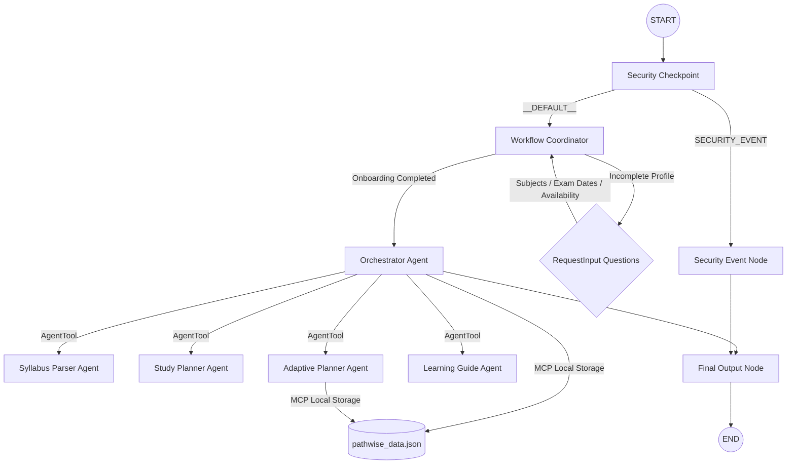

# PathWise Submission Write-Up

## Problem Statement
University and college students preparing for exams face significant decision fatigue when trying to plan and manage their study sessions. With multiple syllabi, varying exam dates, and changing daily availability, students often waste valuable study time deciding where to start, what to prioritize, or how to recover after missing a study session. PathWise solves this by serving as an AI study decision companion that answers the simple question: *"What should I study next?"* 

---

## Solution Architecture

---

## Concepts Used

1. **ADK Workflow**: The application's main topology is structured as a stateful, graph-based DAG using `google.adk.workflow.Workflow` in [agent.py](file:///c:/Users/Pranavi/OneDrive/Documents/adk-workspace/pathwise/app/agent.py#L369-L377).
2. **LlmAgent**: Five specialized agents (`orchestrator_agent`, `syllabus_parser_agent`, `study_planner_agent`, `adaptive_planner_agent`, and `learning_guide_agent`) are declared in [agent.py](file:///c:/Users/Pranavi/OneDrive/Documents/adk-workspace/pathwise/app/agent.py#L108-L232) to perform isolated cognitive tasks.
3. **AgentTool**: Used by the `orchestrator_agent` to dynamically delegate tasks to specialist agents (`SyllabusParser`, `StudyPlanner`, etc.) in [agent.py](file:///c:/Users/Pranavi/OneDrive/Documents/adk-workspace/pathwise/app/agent.py#L225-L230).
4. **MCP Server**: Implemented in [mcp_server.py](file:///c:/Users/Pranavi/OneDrive/Documents/adk-workspace/pathwise/app/mcp_server.py) to manage the student profile and study roadmap storage via stdio-based transport, and wired into agents using `McpToolset`.
5. **Security Checkpoint**: The `security_checkpoint` function node in [agent.py](file:///c:/Users/Pranavi/OneDrive/Documents/adk-workspace/pathwise/app/agent.py#L235-L315) intercepts all user inputs to enforce PII scrubbing, injection blocklists, and domain-specific validation.
6. **Agents CLI**: Scaffolding was generated using `agents-cli` and configured to run locally via `Makefile` targets.

---

## Security Design

- **PII Scrubbing**: User inputs are scanned using regular expressions to scrub email addresses, phone numbers, and SSNs. This protects students from accidentally submitting personal information.
- **Prompt Injection Detection**: Inputs are checked against a blocklist (`ignore instructions`, `system prompt`, `dan mode`, etc.). If triggered, the workflow immediately routes traffic to a terminal security event node.
- **Structured Audit Logging**: Stderr logs output a structured JSON object detailing every security checkpoint decision (status, event, and severity).
- **Domain restriction**: Exclude keywords like `hack`, `steal`, `cheat`, or `plagiarize` to ensure academic integrity.

---

## MCP Server Design

The [mcp_server.py](file:///c:/Users/Pranavi/OneDrive/Documents/adk-workspace/pathwise/app/mcp_server.py) exposes the following tools:
1. `get_student_profile`: Retrieves student profile from [pathwise_data.json](file:///c:/Users/Pranavi/OneDrive/Documents/adk-workspace/pathwise/pathwise_data.json).
2. `save_student_profile`: Saves student fields gathered during onboarding.
3. `get_roadmap`: Retrieves the list of study tasks.
4. `save_roadmap`: Stores a newly generated or modified roadmap.
5. `update_progress`: Updates status (completed/missed) and difficulty feedback.
6. `retrieve_resources`: Suggests curated textbook and video resources.
7. `generate_roadmap_summary`: Summarizes progress metrics.

---

## Human-in-the-Loop (HITL) Flow

PathWise requires a conversational onboarding workflow using `google.adk.events.request_input.RequestInput` inside the `workflow_coordinator` node. This pauses execution to gather:
- Subjects/courses
- Exam dates
- Daily study availability
- Preferred session lengths
- Strengths and weaknesses

Gathering this information directly from the student guarantees a hyper-personalized roadmap.

---

## Demo Walkthrough

1. **Onboarding**: A new student interacts with PathWise, providing study attributes in response to step-by-step questions. A personalized JSON roadmap is then generated.
2. **"Today's Focus"**: Asking *"What should I study next?"* prints the first topic from the roadmap queue, estimated time, resources, and explanation.
3. **Adaptive Update**: Providing feedback like *"Genetics was too hard"* triggers the Adaptive Planner to modify the roadmap (e.g. splitting the topic or adding study buffer hours).

---

## Impact / Value Statement

PathWise helps students manage academic stress and overcome executive dysfunction. By turning large syllabi and tight deadlines into simple, bite-sized daily recommendations, PathWise ensures students spend less time planning and more time learning.
